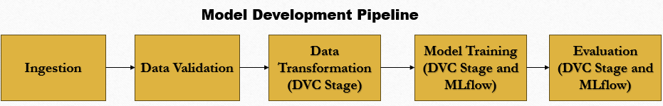
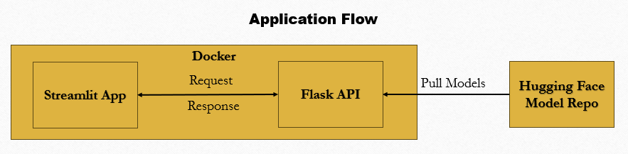
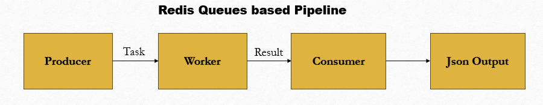
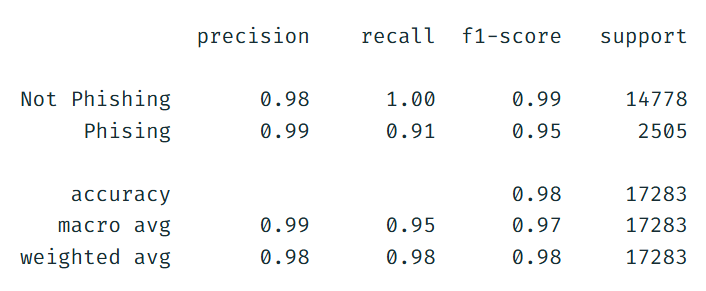

# Phishing URL Detection

## Demo 
**APP URL**: https://phishing-url-detection-application.onrender.com <br>
**API URL**: https://phishing-url-detection-96af.onrender.com <br>

*Deployed on Render*

> **Note:** This project is deployed on Render's free tier, which spins down 
> after inactivity. If you're testing the app, please open the **API** link 
> first and wait for it to respond before using the **APP**.

## Overview
A project which uses an url to build few required features and identifies whether it is Phishing or not.

Two implementation available: <br>
&emsp;→ Streamlit with Flask based API (/app and /api) <br> 
&emsp;→ Redis Queues based inferencing (/RedisComponents) <br> 

Dockerfiles and Docker compose is available for Streamlit and Flask based solution.

## Architecture 

 



*Redis Queues based solution was designed to handle fluctuating incoming request volume and enable robust, decoupled background processing* 

## Setup and Usage

### Prerequisites
&emsp;→ MLflow related parameters from DagsHub should be present in .env if experiment tracking in DagsHub is required <br>
&emsp;→ The API_URL parameter must be present in .env where API_URL should point to the /predict route of the API.  <br>
&emsp;→ Have Docker installed. 

### Installation
#### 1. Clone the repo 
```bash 
git clone https://github.com/SivaKumarPalanirajan/Phishing-Url-Detection.git 
cd Phishing-Url-Detection
``` 

#### 2. Install requirements 
```bash
pip install -r requirements.txt
```

#### 3. Pull dvc tracked artifacts 
```bash 
dvc pull
```

#### 4. Execute the stages
```bash 
dvc repro
```
This will rerun the stages whose dependencies have changed.

### Execution (for Streamlit and Flask based solution)

#### 1. Docker compose
```bash 
docker compose up
```

#### 2. Use the application or the api 
&emsp;→ The streamlit app will be available at `http://localhost:8080` <br> 

&emsp;→ The API will be available at `http://localhost:8000` <br>

*If no changes were made in docker compose*

### Execution (for redis queues based solution)

#### 1. Redis setup using Docker
```bash 
docker run -d -p 6379:6379 redis
```

#### 2. Start the worker 
```bash 
python -m RedisComponents.Worker
```
Run this command in multiple terminals to spin up multiple workers and increase parallelism.

#### 3. Load tasks into the main queue (Producer)
```bash 
python -m ProducerConsumer --mode producer --inp-url <url>
```

#### 4. Save results (Consumer)
```bash 
python -m ProducerConsumer --mode consumer --out-dir <OutputDirectory>
```

## Tech Stack 
&emsp;→ **Versioning**: Git, DVC, Github and DagsHub <br>
&emsp;→ **Experiment**: Tracking MLflow <br>
&emsp;→ **Deployment**: Render and Docker <br>
&emsp;→ **Framework**: Streamlit and Flask <br>
&emsp;→ **Task Queues**: Redis and Redis Queue (CLI-driven Inferencing)

## Deployment Ready
The streamlit application with Flask API can be deployed using the dockerfiles along with the docker compose.

## Results 

| **Metric** | **Value**|
|------|------|
|Accuracy|98.5%|
|Precision|98.6%|
|Recall|91%|

### **Classification Report** <br>


## Dataset & Attribution
This project uses the URL-Phish dataset. The dataset was obtained from Kaggle, where it is available as [Phishing URL Detection (111K URLs, 22 Features)](https://www.kaggle.com/datasets/sahandnamvar/phishing-url-detection-111k-urls-22-features).

The dataset is originally licensed under **[Creative Commons Attribution 4.0 International (CC BY 4.0)](https://creativecommons.org/licenses/by/4.0/)**, 
which permits sharing, redistribution, and adaptation with appropriate credit.

**Dataset citation**<br>
>Dam Minh, Linh; Tran Cong, Hung (2025).<br>
>URL-Phish: A Feature-Engineered Dataset for Phishing Detection.<br>
>Mendeley Data, V1.<br>
>DOI: https://doi.org/10.17632/65z9twcx3r.1<br>

**Original data sources referenced by the dataset authors**<br>
>PhishTank – Community-driven phishing URL repository<br>
>Research Organization Registry (ROR) dataset – Source of trusted benign domain URLs<br>

**Paper citation**<br>
>Dam Minh Linh, Tran Cong Hung, <br>
>A feature-engineered dataset of benign and phishing URLs for machine learning and large language models evaluation,<br>
>Data in Brief,<br>
>Volume 63,<br>
>2025,<br>
>112162,<br>
>ISSN 2352-3409,<br>
>https://doi.org/10.1016/j.dib.2025.112162.

**Modifications:** <br>
The following preprocessing was applied to the original dataset:
- Duplicate rows and null/missing values were checked for and removed, if present
- Feature scaling applied to selected numeric features
- TF-IDF encoding applied to selected URL/text-derived feature(s)
- Data split into train / validation / test sets

**Feature usage:** <br>
The final model was trained using a selected subset 
of the features; the remaining 
features were excluded at training time via feature selection, not by removing them from 
the stored datasets.

## License
- **Code**: MIT License — see `LICENSE`
- **Data**: Raw and processed datasets are redistributed under original **Creative Commons Attribution 4.0 International (CC BY 4.0) license**, consistent with the original dataset's license (see Dataset & Attribution above).
- **Model & preprocessors**: MIT License — trained artifacts are provided under the same 
  terms as the codebase. Model trained on **Creative Commons Attribution 4.0 International (CC BY 4.0) license** data; see Dataset & Attribution section for details.